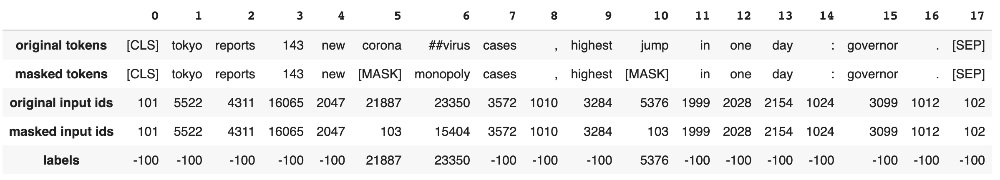

# Data Collator for Keyword/Compact Pretraining
Keyword/compact pretraining is a pretraining technique that only masks the tokens associated with a given list of words. These words, in our case, are keywords extracted from the documents or their summary. When applying this pretraining method to summaries, we use the term "compact pretraining." However, it is known as a "keyword pretraining" method when it is used with actual unstructured data.

The selection of keywords can be done either manually or automatically. In order to automate this process, we used [KeyBERT](https://github.com/MaartenGr/KeyBERT) as our keyword extraction technique in our paper. Additionally, we employed [BART](https://arxiv.org/abs/1910.13461) to produce the summary of documents.

# Installation
* You can use pip to install the package you need for keyword/compact pretraining:

```
pip install KeywordMasking
```

&nbsp;&nbsp;&nbsp;&nbsp;&nbsp;&nbsp;&nbsp;&nbsp;Then, you can import the data collator:

```
from KeywordMasking import DataCollatorForKeywordMasking
```

* Also, you can copy and paste the code from [here](https://github.com/shahriargolchin/compact-pretraining/tree/main/keyword-pretraining-code) to use our data collator in your script. This recommendation is advised for development purposes.

# Example
An example of a sentence and its masked version is shown below:

<p>Example text: "Tokyo reports 143 new coronavirus cases, highest jump in one day: governor."<br>
Example keywords: "coronavirus", "jump"</p>



Click [here](https://github.com/shahriargolchin/compact-pretraining/tree/main/examples) for further examples and the corresponding code.

# Notes
* You need access to a GPU in order to pretrain a language model using `DataCollatorForKeywordMasking`.
* The dataloader should be configured to use sub-processes when loading data in order to make the most of the GPU. Setting dataloader's number of workers to a value other than zero accomplishes this. When using [Hugging Face](https://huggingface.co/docs/transformers/main_classes/trainer), this option can get activated in the trainer `TrainingArguments` via `dataloader_num_workers`; however, when using [PyTorch](https://pytorch.org/docs/stable/data.html), it can be found as `num_workers` argument in DataLoader.

# Citation
If you found our work helpful for your project, you can cite our work using the following bibtex:
```
@article{golchin2022compact,
  title={A Compact Pretraining Approach for Neural Language Models},
  author={Golchin, Shahriar and Surdeanu, Mihai and Tavabi, Nazgol and Kiapour, Ata},
  journal={arXiv preprint arXiv:2208.12367},
  year={2022}
}
```

The original paper is also freely accessible via this [link](https://arxiv.org/abs/2208.12367).
